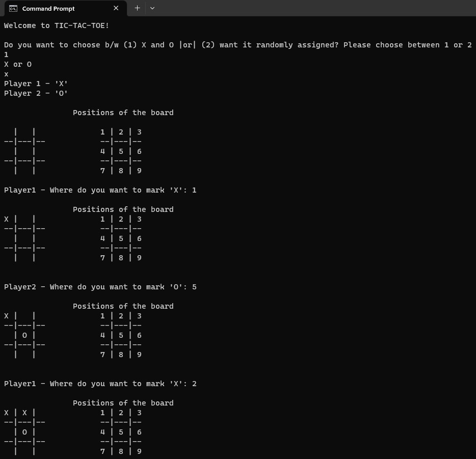
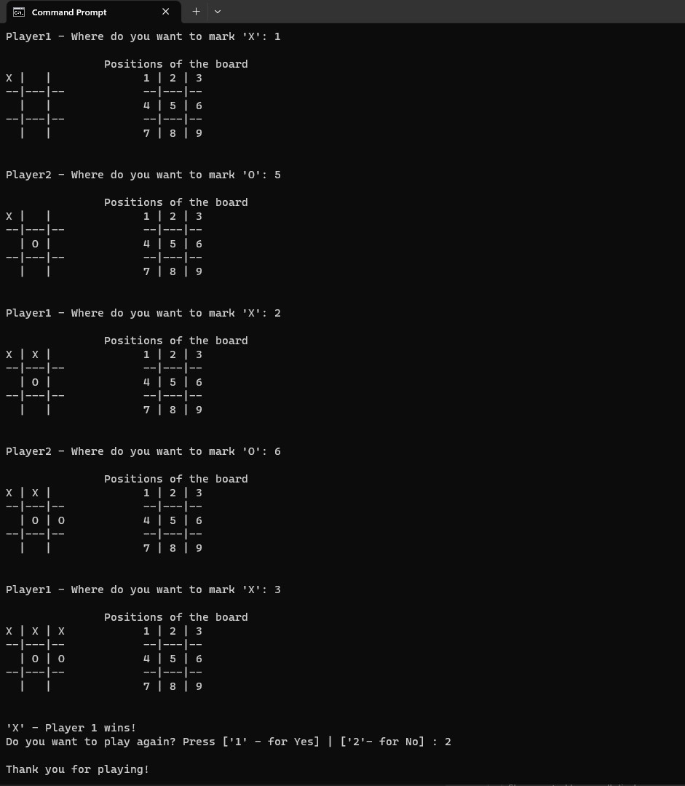

# classic_python_tictactoe

A simple and robust pythonic tic-tac-toe game. It is played between two-players in which the objective is to take turns and mark the correct spaces in a 3x3 grid using 'X's or 'O's.
 

### Usage

    python app.py

 

### Played in turns between 2 players.
 

___Have fun!___